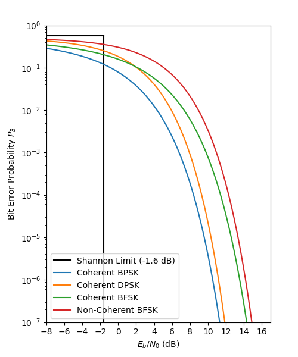

## NTPU Fall Digital Communications - Final Project

### Prerequisites (Tested with Python 3.8.18 on macOS Ventura 13.6.2)

1. Create & activate a new virtualenv
    ```shell
    # virtualenv env && ./env/bin/activate
    ```

2. Install dependency packages (NumPy, SciPy, Matplotlib...)
    ```shell
    # pip install -r requirements.txt
    ```

### BPSK Simulation

1. Running the simulation
    ```shell
    # python bpsk_simulation.py
    ```
   
2. Example Output:
    ```text
    ====== Eb/N0 = 0.0 db ======
    Theoretical BER: 0.0786496035251425
    BER from Experiment: 0.07903

    ====== Eb/N0 = 3.010299956639812 db ======
    Theoretical BER: 0.02275013194817921
    BER from Experiment: 0.02268

    ====== Eb/N0 = 6.020599913279624 db ======
    Theoretical BER: 0.0023388674905235884
    BER from Experiment: 0.00259
    ```

### Plotting BEP Comparison on Different Modulation Schemes

1. Running the plotting script
    ```shell
    # python bep_comparison.py
    ```
   
2. Example Output:

 
